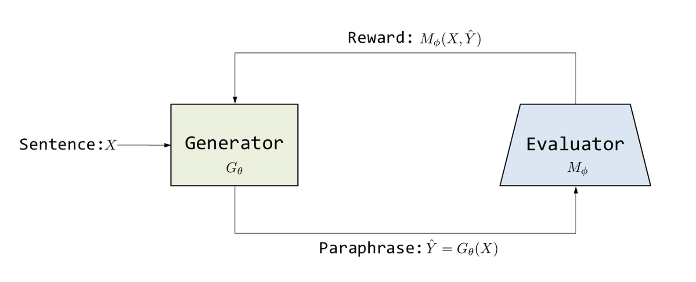
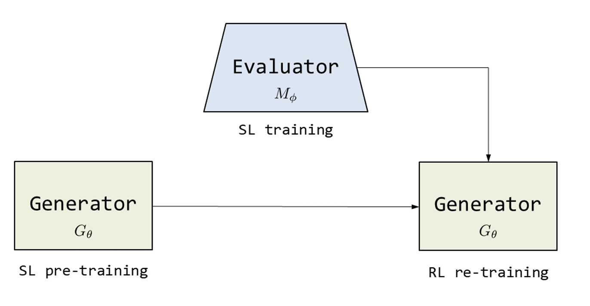
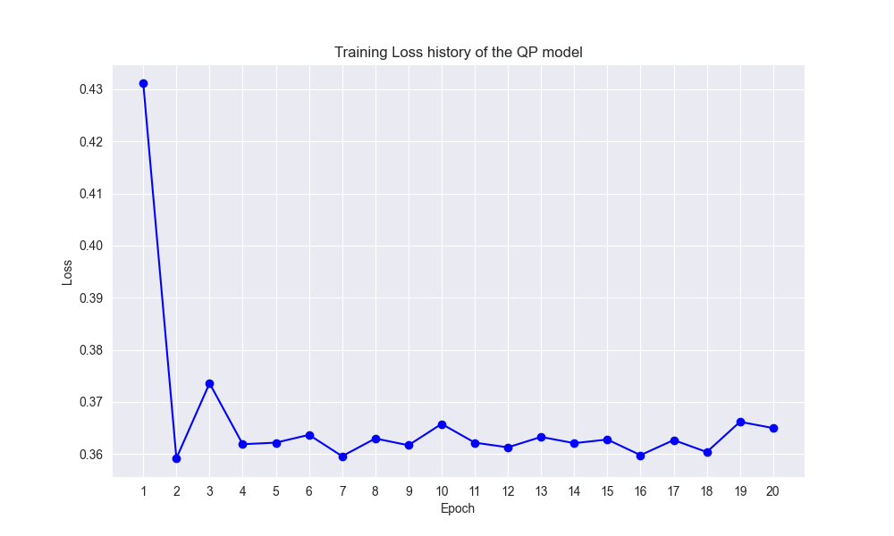
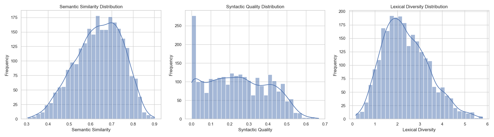
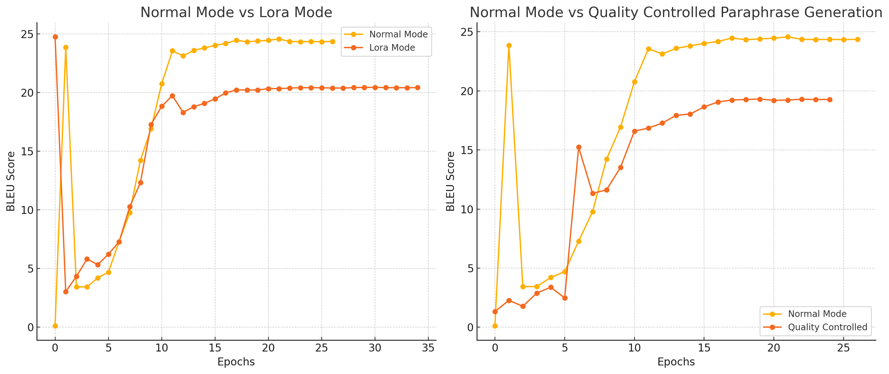
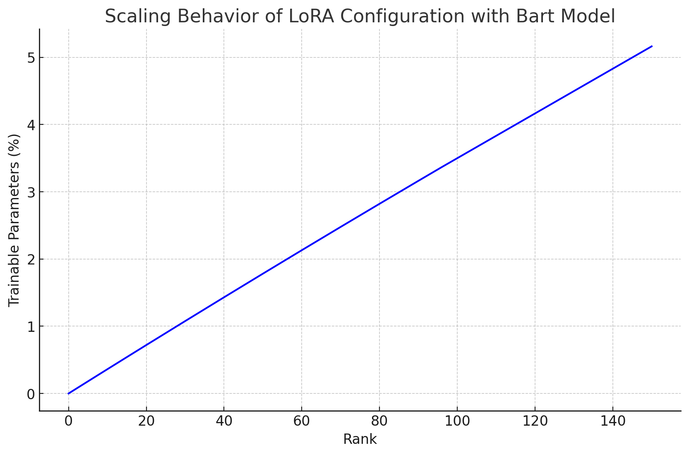

# DNLP SS24 Final Project

This is the code by the Group "Text Titans" for the final project of the Deep Learning for Natural Language Processing course at the University of Göttingen. 

<!-- toc -->

## Project Description

This project focuses on implementing and improving models for various NLP tasks using BERT and BART. The key tasks include sentiment analysis, paraphrase detection, semantic similarity, paraphrase type detection, and paraphrase type generation. We implemented baseline models for each task and improved them using various methods.

The complete description of all tasks, datasets and project files can be read [here](https://docs.google.com/document/d/1pZiPDbcUVhU9ODeMUI_lXZKQWSsxr7GO/edit?usp=sharing&ouid=112211987267179322743&rtpof=true&sd=true).


# Text Titans

-   **Group name:** Text Titans
    
-   **Group code:** G03
    
-   **Group repository:** https://github.com/corinnawegner/DLN_project_G03/
    
-   **Tutor responsible:** [Niklas Bauer](https://github.com/ItsNiklas/)
    
-   **Group members:** [Corinna Wegner](https://github.com/corinnawegner), [Minyan Fu](https://github.com/Minyan-Fu), [Yiyang Huang](https://github.com/yiyang26), [Amin Nematbakhsh](https://github.com/nematbakhsh)

  
# Setup instructions 
<!---
Explain how we can run your code in this section. We should be able to reproduce the results you've obtained. 

Which files do we have to execute to train/evaluate your models? Write down the command which you used to execute the experiments. We should be able to reproduce the experiments/results.

_Hint_: At the end of the project you can set up a new environment and follow your setup instructions making sure they are sufficient and if you can reproduce your results. 

* Follow `setup.sh` to properly setup a conda environment and install dependencies.
* There is a detailed description of the code structure in [STRUCTURE.md](./STRUCTURE.md), including a description of which parts you will need to implement.
* You are only allowed to use libraries that are installed by `setup.sh` (Use `setup_gwdg.sh` if you are using the GWDG clusters).
* Libraries that give you other pre-trained models or embeddings are not allowed (e.g., `transformers`).
* Use this template to create your README file of your repository: <https://github.com/gipplab/dnlp_readme_template>
--->

To create a virtual environment on the cluster reproduce the code, run

```shell
setup_gwdg.sh
```

Libraries not included in the conda environment are listed in

```shell
external_packages.sh
```

To run the paraphrase type generation task, use 

```shell
run_train_corinna.sh
```

Here’s a list of the command-line arguments with their descriptions:


| Parameter               | Description                                                                 |
| ----------------------- | --------------------------------------------------------------------------- |
| `--optimizer`           | Optimizer to use. Default is `Adam`.                                        |
| `--learning_rate`       | Learning rate for the optimizer. Default is `8e-5`.                         |
| `--batch_size`          | Batch size for training. Default is `64`.                                   |
| `--patience`            | Patience for early stopping. Default is `5`.                                |
| `--num_epochs`          | Number of epochs for training. Default is `100`.                            |
| `--alpha`               | Alpha value for loss function engineering. Default is `0.001`.                         |
| `--POS_NER_tagging`     | Enable POS and NER tagging. This is a flag (no value required).             |
| `--l2_regularization`   | L2 regularization coefficient. Default is `0.01`.                           |
| `--seed`                | Random seed for reproducibility. Default is `11711`.                        |
| `--use_gpu`             | Use GPU for training. This is a flag (no value required).                   |
| `--use_QP`              | Enable Quality Predictor. This is a flag (mutually exclusive).         |
| `--use_lora`            | Enable LoRA (Low-Rank Adaptation). This is a flag (mutually exclusive).     |
|`-lora_rank`|    The rank of the LoRa config, note that `--use_lora` needs to be activated. Default `96` |
| `--use_RL`              | Enable Reinforcement Learning. This is a flag (mutually exclusive).         |
| `--tuning_mode`         | Enable tuning mode. This is a flag (mutually exclusive).                    |
| `--normal_mode`         | Enable normal operation mode. This is a flag (mutually exclusive).          |


**Setup warning**: Just around the time of project submission there occured an [issue](https://github.com/nltk/nltk/issues/3308) with the `nltk` library, which is used in the project. If it persists to exist in the future and causes problems with the setup, it might be necessary to download an older version:

```shell
pip install nltk==3.9b1
```

To run minBERT use 

```shell
run_train_minBERT.sh
```

| Parameter                     | Description                                                                 |
| --------------------------------- | --------------------------------------------------------------------------- |
|`--additional_input` |Use POS tags and NER tags for the input of minBERT.|
| `--use_gpu`  | Use gpu to train |
| `--option`  | choose finetune or pretrain |
| `--task`  | choose which task to work. 'sts', 'sst', 'qqp', 'eptc' or 'multitasks'. |
| `--hidden_drop_prob` | set the dropout probability for the hidden layers |
| `--loss_function` | choose loss function 'mse' or 'mnrl' in sts and qqp task |
| `--add_smooth`  | Fine-Tuning with Regularized Optimization |


To execute the code for BART paraphrase type detection task, run the following file.
```shell
run_train_bart_det.sh
```
It accepts the following arguments:

| Parameter           | Description                                     |
|---------------------|-------------------------------------------------|
| `--train-batch-size`| The batch size for training phase.              |
| `--val-batch-size`  | The batch size for validation phase.            |
| `--test-batch-size` | The batch size for testing phase.               |
| `--learning-rate`   | The learning rate for the optimizer.            |
| `--use-gpu`         | Flag to enable GPU usage for training.          |
| `--seed`            | Seed for random number generation to ensure reproducibility. |
| `--local-files-only`| Flag to use only local files and avoid network access. |
| `--epochs`          | The number of training epochs.                  |


# Methodology

<!--In this section explain what and how you did your project. 

If you are unsure how this is done, check any research paper. They all describe their methods/processes. Describe briefly the ideas that you implemented to improve the model. Make sure to indicate how are you using existing ideas and extending them. We should be able to understand your project's contribution. -->

In this section we describe all methods that we used to improve our models.

### Earlystopping
*used in: BART generation*

Early stopping is a technique used in machine learning and deep learning to prevent overfitting during the training of a model. It works by monitoring the model's performance on a validation dataset while training. If the model's performance on the validation set stops improving or starts to degrade, training is halted early.

### Dropout

*used in: BART generation*

[Dropout](https://jmlr.org/papers/volume15/srivastava14a/srivastava14a.pdf) is a regularization technique used in machine learning, particularly in neural networks, to prevent overfitting. During training, dropout randomly "drops out" (sets to zero) a fraction of the neurons in the network at each iteration. This forces the model to learn more robust and generalized features, as it cannot rely on specific neurons being present. The dropout rate controls the fraction of neurons dropped. At inference time, all neurons are used, but their outputs are scaled to account for the dropout applied during training.

### Gradient accumulation

*used in: BART generation*

Gradient accumulation is a technique used in training deep learning models, especially when dealing with large batch sizes that might not fit into memory. Instead of updating the model's weights after each mini-batch, gradient accumulation involves accumulating gradients over several mini-batches and performing a weight update only after a specified number of mini-batches.

### L2 regularization 

*used in: BART generation*

L2 regularization is a technique used to prevent overfitting in machine learning models by adding a penalty to the loss function. This penalty is proportional to the sum of the squared values of the model's weights. By penalizing large weights, L2 regularization encourages the model to learn smaller, more evenly distributed weights, leading to a model that generalizes better to new data.


### Additional Input Features (POS and NER Taggings)
*used in: BART generation & minBERT*

Based on [Enhancing Pre-Trained Language Representations with Rich Knowledge for Machine Reading](https://aclanthology.org/P19-1226/) by Xinyan Xiao, et al., incorporating rich semantic information such as Part-of-Speech(POS) tags and Named Entity Recognition(NER) tags into pretrained language models to enhance machine reading comprehension abilities. These additional features not only provide more grammatical and semantic infromation but also help the more better understand the contexts. The application of these technologies significantly improves the model's accuracy and efficiency in tasks such as reading comprehension and information extraction.


### Loss function engineering
*used in: BART generation*

A common problem occurring in the generation task is that the model learns to copy the input sentence rather than paraphrasing it. This is captured by the negative BLEU score in the validation process. However, our idea was to directly engineer the loss function to tackle this problem. BartForConditionalGeneration, as most language models, uses [cross entropy loss](https://github.com/huggingface/transformers/blob/v4.44.2/src/transformers/models/bart/modeling_bart.py#L1557). Cross entropy computes the loss based on the probability of the sentences given the training corpus. However, it does not necessarily punish a sentence very close to the input or monotonic vocabulary use. To leverage the lexical diversity and avoid common n-grams between input and predicted sentence, we implemented two penalty functions, scaled with corresponding and tuned factors &alpha;, and added the penalty to the loss:


+\alpha_{\text{diversity}}\times\text{diversity-penalty}(\text{input},\text{predictions}))

$$
\text{loss} = \text{loss}_{\text{crossentropy}} + \text{loss}_{\text{L2}} + \text{loss}_{\text{penalty}}
$$

$$\small
\text{loss}_{\text{penalty}} = \alpha_{\text{ngram}} \times \text{n-gram-penalty}(\text{input}, \text{predictions}) + \alpha_{\text{diversity}} \times \text{diversity-penalty}(\text{input}, \text{predictions})
$$


The n-gram penalty discourages the model from replicating phrases from the input by penalizing the overlap of n-grams between the input and the generated text. It counts the occurrences of n-grams shared by both the input and prediction, with the penalty increasing proportionally to their frequency and length. This method ensures that the model avoids copying sequences directly from the input, promoting more varied outputs.

The diversity penalty enhances lexical variety by penalizing the generation of frequently occurring words shared between the input and prediction. By identifying common words that exceed a specified frequency threshold, the penalty encourages the model to use a broader range of vocabulary, reducing repetitive or monotonic language in the generated text.

We looked for similar implementations on google scholar but couldn't find a reference publication. However, the idea of using a custom loss function tailored to our specific problem was inspired by [Corinna's Bachelor Thesis](https://github.com/corinnawegner/denoising_fingerprints_code/blob/main/Wegner_Corinna_Bachelor_Thesis_Corinna_Elena_Wegner.pdf).

### Parameter-efficient finetuning (PEFT) using LoRA
*used in: BART generation*

[Parameter-efficient fine-tuning (PEFT)](https://arxiv.org/pdf/2312.12148) is a concept to finetune pre-trained models without needing to update or store all of its parameters, which can be computationally expensive and memory-intensive. There are multiple possible methods belonging to PEFT, one of them is [Low-Rank Adaptation (LoRA)](https://arxiv.org/pdf/2106.09685).

 Instead of updating all the model's weights, LoRA freezes the pre-trained model and inserts small, trainable rank decomposition matrices within each layer of the transformer architecture. This approach can reduce the number of trainable parameters and decrease GPU memory requirements. LoRA operates in parallel to the model's feed-forward layers, where it processes input through smaller, intermediate layers before combining the output with the original model's output, allowing for efficient task adaptation with no additional inference latency.


### Paraphrase Generation with Deep Reinforcement Learning

*used in: BART generation*

Reinforcement Learning (RL) is a method where an agent learns to make decisions by interacting with an environment. The agent takes actions, and based on these actions, it receives feedback in the form of rewards. The goal is to maximize the reward by learning which actions lead to the best outcomes (states). This approach helps the agent to assign values (expected rewards) to states and develop an optimal strategy, the so called policy.

Based on the paper by [Li et. al.](https://arxiv.org/pdf/1711.00279) we implement a Reinforcement learning method to refine the generation model. The generation model acts as a RL-agent We normally finetune the generation model first. In the refinement, we let it generate a paraphrase to an input. Our idea was to use the BERT paraphrase detector for the reward computation. It determines whether the generated sentences are paraphrases. Then, we can change the weights of the generator with the reward signal:

=\sum_{t=1}^{T}\left[\nabla_{\theta}\log{p_{\theta}(\hat{y}_t\mid\hat{Y}_{1:t-1},X)}\right]r_t)

In the paper, the authors define a positive reward only at the end of the sentence (i.e. $r_t = r_T$), assigning to the other positions a reward of zero. Thereby, it is possible to apply stochastic gradient descent.

<p align="center">
  
  
</p>


### Quality Controlled Paraphrase Generation
*used in: BART generation*

[Bandel et. al](https://arxiv.org/pdf/2203.10940) published a method to enhance the quality of predicted paraphrasing by adding a quality vector $\bar{q} = (q_{lex}, q_{sem}, q_{syn})$ to the input of the generator model. The values stand for lexical diversity, semantic similarity and syntactic accuracy, respectively. 

A quality predictor (QP) learns to predict appropriate quality vectors for a given sentence. The key here is that for a given input sentence, not every quality dimension can be equally well realized. For example, if a sentence contains a lot of named entities (persons, cities etc.), it is not really possible to obtain a very high lexical diversity. The QP should learn for a sentence which quality dimensions can be realised best and assign these dimensions a high value.

The generation model learns to associate the quality dimensions with the sentence pairs and thereby produces paraphrases with a focus on those quality dimensions that have a high q-value in the respective quality vector.


### Additional Layers
*used in minBERT*

Adding additional layers in BERT model is to improving model performance on specific tasks, as different tasks may require the extraction of different textual features. By adding customized layers after the input or output layer of the model, it can better adapt to the specific requirements of the task. The most common methods are adding normalization layers, linear transfromation layers, activation layers and so on. Such customization not only helps enhance the models' adaptability but also improves its performance and efficency in downstream tasks.


### Z-score Normalization
*used in minBERT*

Linear transformation preserves the absolute distance of the data and will be affected by the maximum and minimum values in the data set. However, z-score normalization preserves the relative distance of the data and the distribution form of the data. It can better contain the information originally conveyed by the data set.

### Multiple Negative Ranking Loss Learning
*used in minBERT*

[Henderson et al., 2017](https://arxiv.org/abs/1705.00652) provide a method to improve the judgement of sentence similarity. The principle of this method is to reduce the distance between similar sentence pairs and amplify the differences between different sentence pairs. It does this by scaling down the approximated mean negative log probability. In our project, both the STS task and the QQP task can determine whether the pair of sentences are similar through labels. So we can briefly classify them by labels and apply multiple negative ranking loss learning to train the model.

### Fine-Tuning with Regularized Optimization
*used in minBERT*

[Jiang et al., 2020](https://arxiv.org/abs/1911.03437) introduce two methods to avoid the overfitting problem. The first is smoothness-inducing regularization. It makes model changes smoother by adding regularization terms. This gives constraints to the model parameters changing to ensure the output will not drastically change between different inputs. The second is Bregman proximal point optimization. It uses the Bregman distance to define a trust region that limits the magnitude of updating. It ensures stable convergence during the optimization process and avoids overfitting.

### Learning rate scheduler
*used in BART detection, BART generation & minBERT*

A learning rate scheduler is a strategy used to adjust the learning rate during training to improve model convergence and performance. It dynamically changes the learning rate according to a pre-defined schedule or rule, helping the model escape local minima and converge more smoothly. Commonly used learning rate schedulers are ReduceLROnPlateau get_linear_schedule_with_warmup and StepLR.

ReduceLROnPlateau monitors a specified metric (such as validation loss) and reduces the learning rate when this metric stops improving, i.e., plateaus. This helps in fine-tuning the model by allowing it to converge more smoothly and potentially reach a better local minimum. It’s particularly useful for training deep neural networks where learning rate adjustments can significantly impact the final performance.

# Experiments

<!---Keep track of your experiments here. What are the experiments? Which tasks and models are you considering?

Write down all the main experiments and results you did, even if they didn't yield an improved performance. Bad results are also results. The main findings/trends should be discussed properly. Why a specific model was better/worse than the other?

You are **required** to implement one baseline and improvement per task. Of course, you can include more experiments/improvements and discuss them. 

You are free to include other metrics in your evaluation to have a more complete discussion.

Be creative and ambitious.

For each experiment answer briefly the questions:

- What experiments are you executing? Don't forget to tell how you are evaluating things.
- What were your expectations for this experiment?
- What have you changed compared to the base model (or to previous experiments, if you run experiments on top of each other)?
- What were the results?
- Add relevant metrics and plots that describe the outcome of the experiment well. 
- Discuss the results. Why did improvement _A_ perform better/worse compared to other improvements? Did the outcome match your expectations? Can you recognize any trends or patterns? --->

In this section we describe in detail how we used the described methods and present our results

## Experiments on Paraphrase Type Generation

To evaluate paraphrase generation with BART, the metric used is the penalized BLEU score. The idea is to penalize copying the input sentence. It is given by:

$$
\text{Penalized BLEU} = \frac{\text{BLEU}(ref, pred)(1-\text{BLEU}(input, pred))}{52}
$$


The model's performance is evaluated on a validation set (20% of the training dataset), as there are no reference sentences provided in the test set.

### Standard training enhancements & hyperparameter tuning

After implementing the baseline, we started by applying some standard training methods, in addition to the Adam optimizer. These includes earlystopping, ReduceLearningOnPlateau, L2 regularization. Using these, we did a second hyperparameter tuning to obtain an improved score.

We particularly chose L2 regularization, because it evenly lowers the weights, as opposed to L1 regularization. We believe that over the sequences, all positions could be potentially important.

We also included a different dropout rate in our hyperparameter tuning, but figured that the rate implemented by default performs best already (view hyperparameter tuning section for details). The obtained results 

    Penalized BLEU: 23.7
    BLEU Score: 20.8
    Negative BLEU Score with input: 59.1 

suggests that the model is not yet able to learn representations close to the references. 

With the implementation of more features and methods, out of memory issues occured frequently. Batch sizes above 32 were after some point not possible to use, although the batch size of 64 had proven to be better during the baseline hyperparameter search. Therefore, we implemented gradient accumulation to simulate a higher batch size.

### POS & NER tagging

We used the spacy library to obtain linguistic tags for the sequence tokens in the input. The scores obtained are: 

    Penalized BLEU 23.8
    BLEU 31.3
    Negative BLEU with input 39.7

Looking at the result, although the penalized BLEU score has only marginally improved, we have at the same time reached a significantly (by ~10) improved alignment of the predictions to the references. This results suggest that this method supports the model in generating more variety in the sentence structure, as it was  Therefore, we keep the tagging for all future experiments.

Note that this comes at the cost of a decreased negative BLEU, suggesting an increased copying of input sentences. A reason for this might be that the model must learn to remove the tags from the input in addition to all other input features like paraphrase types, which potentially binds resources of the model. 


### Just using the pretrained model

We wanted to see how the model performs using the pretrained BART only, with additional POS/NER tagging as input. We found, at first glance, a surprisingly good score:

    BLEU Score: 21.8
    Negative BLEU Score with input: 54.4
    Penalized BLEU Score: 22.8

We investigated the surprisingly high score for the non-finetuned model by looking at the input - prediction pairs. The reason is that the model without finetuning produces copies of the input ID's. Besides the input sentence, these include also the paraphrase types. Thus, the negative BLEU score is already relatively high (due to "uncommon n-grams" - the negative BLEU compares the reproduced sentences with the original sentences from the dataset, not the detokenized input). The model quickly learns to leave out every non-sentence token from the input, resulting in a true copy of the input sentence. At this point the negative BLEU score is tiny and so drops the penalized BLEU. This is where the actual learning of the model begins.


### Loss function engineering

The score after the secondary hyperparameter tuning results and subsequent observation of input-reference-pairs (human evaluation) revealed a strong tendency of the model to copy large parts of the input sentence. As described in Methodology, the cross entropy loss does not necessarily penalize this. Thus, we implemented a custom loss function that does this better (see methods).

After testing out some values for &alpha;, we found 0.001 to be optimal. It scales the two functions to a range such that the penalty term neither overshadows the loss nor vanishes. We report a penalized BLEU Score of 24.6 for the validation set. Besides, consistent with our expectation, the negative BLEU score rises again to 45.2.

We decided to keep loss function engineering in our training algorithm.


<details>

Let's look at some predicted sentences to evaluate the performance of the model at this state:
    
| **Inputs**                                                                                                                                                   | **Predictions**                                                                                                                                             | **References**                                                                                                                                                 |
|--------------------------------------------------------------------------------------------------------------------------------------------------------------|-------------------------------------------------------------------------------------------------------------------------------------------------------------|----------------------------------------------------------------------------------------------------------------------------------------------------------------|
| Under state law, DeVries must be released to the jurisdiction in which he was convicted.                                                                     | Under state law, DeVries must be released to the jurisdiction in which he was convicted.                                                                     | Under state policy, DeVries was to be returned to San Jose, where he was last convicted.                                                                         |
| Today, we preserve essential tools to foster voice competition in the local market.                                                                          | Today, we preserve tools to foster voice in the foster competition in the local market.                                                                      | "We preserve essential tools to foster voice competition," Copps said.                                                                                           |
| Medical investigators matched the body's teeth to Aronov's dental records this morning, medical examiner's spokeswoman Ellen Borakove said.                  | Medical investigators matched the body's body's dental records this morning morning.                                                                         | Investigators matched the dead woman's teeth to Aronov's dental records Wednesday morning, medical examiner's spokeswoman Ellen Borakove said.                   |
| In the 2002 study, the margin of error ranged from 1.8 to 4.4 percentage points.                                                                              | In the 2002 study, the margin of error of error from 1.4 percentage from 4.4 points.                                                                         | It has a margin of error of plus or minus three to four percentage points.                                                                                        |
| Claudia Gonzles Herrera, an assistant attorney general in charge of the case, said the arrests show that Guatemala "takes the defense of its ancient Maya heritage seriously." | Claudia Gonzia Herrera Herrera Herrera, an attorney in charge of the case, said the defense of its ancient Maya heritage heritage "ttakes."                  | Claudia Gonzales Herrera, an assistant attorney-general in charge of the case, said the arrests showed that Guatemala took the defence of its Mayan heritage seriously. |

</details>

### Quality controlled paraphrase generation

    
To train the QP model, we annotated the sentence pairs in the training data with quality measures. We used the following measures:

|quality dimension|measure|
|--------| ---------|
| $q_{syn}(s,s′)$ | [Normalized tree edit distance](https://github.com/IBM/quality-controlled-paraphrase-generation/blob/main/metrics/syntdiv_metric/syntdiv_metric.py) between the third level constituency parsetrees of the sentence pairs |
| $q_{lex}(s,s′)$ | Word-level Levenshtein edit distance |
| $q_{sem}(s,s′)$ | [Bleurt score](https://arxiv.org/pdf/2004.04696) |


As a Quality predictor (QP) model, we used a BERT model and trained it on the sentences1 in our data and quality vectors that were obtained from the pairs. We implemented a training algorithm that includes the paraphrase types, as well as POS/NER tagging. Our idea behind this was that paraphrase types may contain information about the quality dimensions that help the QP interpret the output vectors. Besides, we expected that POS/NER tagging would be especially useful for this task. For example, a large number of named entities could potentially be an indicator to lower the lexical diversity score, as it is not feasible to obtain a paraphrase of a high lexical diversity in this case. To obtain an optimal result, we tried different learning rates for the QP model. 

After a couple attempts with different learning rates and epochs, we trained the QP for 20 epochs with a learning rate of 5e-4.

The generator was trained like in the experiments before, except for the addition of the quality dimensions to the input. The QP model trains a bit slow, as can be seen below:


<p align="center">
  

</p>
 
    Penalized BLEU Score: 19.3
    BLEU Score: 36.8 
    Negative BLEU Score with input: 27.3

We initially expected the model to not change that much, because three additional tokens to the model could get lost in the whole input sequence. We observe a stronger tendency to copy from the input. The high BLEU score can be explained with the baseline model. It showed the highest BLEU, but basically copied the input sentences. 

We hypothesize two main reasons for the low performance using the QP model:

1. The quality dimensions contain knowledge about the input, that the model uses in a wrong way. Thereby, it is easier for the model to copy the input.
    
2. Unsuitable data: To see if in the dataset the sentence pairs are varying enough in the quality dimensions for the model to learn, we calculated all quality vectors for the train set sentence pairs. The distributions suggest that we have syntactic quality relatively even distributed, which is preferable, because the model can capture the meaning of the dimension. However, the other quality dimensions are very similar across all sentence pairs. This makes it hard for the model to understand the meaning of them.

<p align="center">
  
</p>

    
<p align="center">
  
</p>


### LoRA

For the implementation of LoRA, we used the `peft` library. Because we fix our base model and train the non-pretrained lora layers, we needed to adapt the learning rate to a higher value. 
    
After careful adaptation of the rank and learning rate we found a rank of 96 and learning rate of 0.001 to deliver the best result.
  
The ratio of trainable parameters scales linearly with the rank. Here's the percentage of trainable parameters depending on the rank for our model:


<p align="center">
  
</p>

<Details>

Here we list some results to illustrate the strong influence of the rank:     

| **Rank** | **Learning Rate (LR)** | **Trainable Params** | **All Params** | **Trainable %** | **Epochs Completed** | **Early Stopping Epoch** | **Best BLEU Score** | **Total Training Time (seconds)** | **Final BLEU Score** | **Negative BLEU Score with Input** | **Penalized BLEU Score** | **Notes** |
|:--------:|:----------------------:|:--------------------:|:--------------:|:---------------:|:--------------------:|:------------------------:|:------------------:|:-------------------------------:|:--------------------:|:------------------------------:|:--------------------------:|:---------:|
| 8        | 2e-4                   | 1,179,648            | 407,471,104     | 0.2895%         | 19                   | 14                        | 2.571               | 3,628.10                        | 47.4937              | 2.8145                          | 2.5706                   | Model learns to copy the input. Lora parameters not large enough. |
| 64       | 0.0007                 | 9,437,184            | 415,728,640     | 2.2700%         | 17                   | 9                         | 18.1102             | 4,509.56                        | 38.2455              | 20.7887                         | 15.2899                   | Training showed improvement initially but faced fluctuations. |
| 96       | 1e-3                   | 14,155,776           | 420,447,232     | 3.3668%         | 35                   | 30                        | 20.4458             | 7,600.37                        | 34.8265              | 30.5279                         | 20.4458                   | Training time comparison with normal model: 4166.32 sec. |

</Details>
    
    
We observe that for a very low rank/number of parameters they could only learn to remove the non-sentence tokens from the input.

LoRA's advantage is a faster training due to reduced number of trainable parameters. Indeed, the best score using the rank=96 LoRA model was obtained after 9 epochs, compared to 22 epochs for the model version at the point of the loss function engineering.


<Details>
    
Again, we provide some predictions from the validation set. 
    
| **Index** | **Input**                                                                                                                                                    | **Prediction**                                                                                                                                               | **References**                                                                                                                                                                         |
|:---------:|:------------------------------------------------------------------------------------------------------------------------------------------------------------:|:-------------------------------------------------------------------------------------------------------------------------------------------------------------:|:---------------------------------------------------------------------------------------------------------------------------------------------------------------------------------------:|
| 0         | Under state law, DeVries must be released to the jurisdiction in which he was convicted.                                                                     | Under state law, DeVries must be released to the jurisdiction in which he was convicted.                                                                      | Under state policy, DeVries was to be returned to San Jose, where he was last convicted.                                                                                                |
| 1         | Today, we preserve essential tools to foster voice competition in the local market.                                                                          | Today, we preserve essential tools to foster voice competition in the local market.                                                                           | "We preserve essential tools to foster voice competition," Copps said. <br> Today, we preserve tools to foster voice voice in the local market.                                         |
| 2         | Medical investigators matched the body's teeth to Aronov's dental records this morning, medical examiner's spokeswoman Ellen Borakove said.                  |  Medical investigators matched the body’s body’s dental records this morning, spokeswoman Ellen Ellen Borakove said                   | Investigators matched the dead woman’s teeth to Aronov's dental records Wednesday morning, medical examiner's spokeswoman Ellen Borakove said.                                          |
| 3         | In the 2002 study, the margin of error ranged from 1.8 to 4.4 percentage points.                                                                              | In the 2002 study, the margin of error from 1.8 to 4.4 percentage points.                                                                              | It has a margin of error of plus or minus three to four percentage points.                                                                                                              |
| 4         | Claudia Gonzles Herrera, an assistant attorney general in charge of the case, said the arrests show that Guatemala "takes the defense of its ancient Maya heritage seriously." | Claudia Gonzia Herrera, an attorney attorney in charge of the case, said the defense of its ancient Maya heritage heritage “takes the case.” | Claudia Gonzales Herrera, an assistant attorney-general in charge of the case, said the arrests showed that Guatemala took the defence of its Mayan heritage seriously. |
</Details> 


### Deep Reinforcement Learning

Previous attempts of fine-tuning yielded a penalized BLEU score of maximum ~24. We have seen that the model tends to stay in this range. Therefore, we considered trying other methods to get a better performance of the model. 

We tried to increase the quality of our paraphrases even more by using a different method and chose Deep Reinforcement Learning. To obtain a RL signal (reward), we developed a function that connects a batch of sentence-pairs (outside of the STS dataset) to the MultiTaskBERT model, which was fine tuned on the STS task. The reason why we chose the STS model instead of the QQP-finetuned BERT was that we wanted to have a reward signal that is non-binary, to increase the variety of the signal. 
    
The text generation model was first regularly fine-tuned. After this process, we trained it in the RL scenario, where it acts as an agent. The generator model creates a paraphrase to the input sentence, and the MultiTaskBERT is deciding on the quality. The output value, initially ranging from 0 to 5, is scaled to a probability. Then, the weights of the generator are updated according to the gradient described in Methodology.

In the standard training, in the last epochs the learning rate had decreased to around 1e-9. So we decided for the RL training to test learning rates of 1e-9 and 1e-8, which acknowledges that the model is close to an optimum, but gives the model a chance to step a bit closer into the right direction.

We report for both learning rates an improved score. For a learning rate of 1e-9, the improvement was however marginal:

    LR: 1e-9
    BLEU Score: 28.4
    Negative BLEU Score with input: 45.0
    Penalized BLEU Score: 24.6

For the higher learning rate we could achieve a higher improvement 

    LR: 1e-8
    BLEU Score: 27.3
    Negative BLEU Score with input: 47.4
    Penalized BLEU Score: 24.9
    
However, the advantage disappears if we select a higher learning rate. Specifically, we tested this method with a learning rate of 1e-6 and obtained a Penalized BLEU score of ~0.0, and a Negative BLEU of virtually 100. This means, the input is fully copied. We explain this observation with the MultiTaskBERT trained on STS. The reward signal it provides is basically a measure of semantic similarity. This is a relevant quality of a paraphrase, however it does not automatically make a good paraphrase. The reward signal only pays attention to this feature, thereby encouraging the model to copy the input sentence. 

<details>

We again provide some example sentences from the validation set:
    
| Index | Inputs                                                                                                                                                                          | Predictions                                                                                                                                       | References                                                                                                                                                    |
|-------|---------------------------------------------------------------------------------------------------------------------------------------------------------------------------------|---------------------------------------------------------------------------------------------------------------------------------------------------|----------------------------------------------------------------------------------------------------------------------------------------------------------------|
| 0     | Under state law, DeVries must be released to the jurisdiction in which he was convicted.                                                                                         | Under state law, DeVries must be released to the jurisdiction in which he was convicted.                                                          | Under state policy, DeVries was to be returned to San Jose, where he was last convicted.                                                                       |
| 1     | Today, we preserve essential tools to foster voice competition in the local market.                                                                                              | Today, we preserve tools to foster voice in the foster competition in the local market.                                                            | "We preserve essential tools to foster voice competition," Copps said.                                                                                         |
| 2     | Medical investigators matched the body's teeth to Aronov's dental records this morning, medical examiner's spokeswoman Ellen Borakove said.                                       | Medical investigators matched the body's body's dental records this morning morning.                                                               | Investigators matched the dead woman's teeth to Aronov's dental records Wednesday morning, medical examiner's spokeswoman Ellen Borakove said.                  |
| 3     | In the 2002 study, the margin of error ranged from 1.8 to 4.4 percentage points.                                                                                                  | In the 2002 study, the margin of error of error from 1.4.                                                                                          | It has a margin of error of plus or minus three to four percentage points.                                                                                      |
| 4     | Claudia Gonzales Herrera, an assistant attorney general in charge of the case, said the arrests show that Guatemala "takes the defense of its ancient Maya heritage seriously."  | Clia Gonzia Herrera Herrera Herrera, an attorney in charge of the case, said the defense of the cases of the ancient Maya.                         | Claudia Gonzales Herrera, an assistant attorney-general in charge of the case, said the arrests showed that Guatemala took the defence of its Mayan heritage seriously. |

    
</details>

To summarize, this method has been proven to be beneficial. However, it must be used with strong care.
    
## Experiments on minBERT
### Additional Pretraining
*used in sst, sts, qqp task*

Additional pretraining refers to taking a model that has already initially pretrained and further training it on a domain-specific dataset using tasks such as Masked Language Modeling(MLM) or Next Sentence Predition(NSP). This will help the model to enhance the understanding and performance within that specific domain.

According to research by [Peng Su et al.](https://www.ncbi.nlm.nih.gov/pmc/articles/PMC8978438/), a BERT model pretrained on a biomedical corpus can more accurately extract features in smaller domains, such as genes and proteins.Considering the distinct characteristics of the datasets in each sub-task, the best pretraining approach is to select a corresponding corpus based on the specifics of each dataset and perform MLM (Masked Language Modeling) or NSP (Next Sentence Prediction) pretraining. However, in the minBERT task, the QQP and STS tasks cover a wide range of topics without a clear theme.Thus, we decided to use highly related corpora for the SST task: the ["Trending YouTube Video Statistics and Comment"](https://www.kaggle.com/datasets/datasnaek/youtube/data) dataset from Kaggle  as an additional set of pretraining material. Since this type of sentiment can be less contextual, we performed MLM in the process of pretreatment.

Unfortunately, this pretrained model did not improve performance on any task. Possible explanations include: 1) The corpus size was too small—pretraining on a larger corpus is typically necessary to help the model learn sufficient language features. 2) The lack of improvement on QQP and STS tasks is reasonable, as the pretrained corpus was more closely related to SST. 3)The contents of the corpus themselves were not sufficiently representative. YouTube comments are often short and consist of many abbreviations and nonstandard language, which could also have caused ineffective model learning.

This method was therefore abandoned and not combined with other methods. Potential improvements could include finding a larger and more suitable corpus or preprocessing the corpus to remove unnecessary comments that do not contribute to training, which could enhance the model's training effectiveness

### Additional Input (POS Tags and NER Tags)

*used in sst,sts,qqp task*

We used SpaCy to add POS tags and NER tags to the text, allowing the model to obtain more semantically relevant information. As expected, the SST task was largely unaffected since NER and POS tags do not significantly contribute to sentiment analysis. However, we observed improvements in the STS and QQP tasks.

### Additional Layers
*used in sst and qqp task*
For different tasks, we tested adding various layers, and the layers that yielded the best results were as follows:
* **SST Task**: We added a linear transformation layer and a ReLU activation layer. Reducing dimensionality before the final classification step allows for further feature extraction and aggregation. Additionally, the ReLU activation function introduces non-linearity, helping the model capture more complex patterns and relationships.
* **QQP Task**: We added a BiAttention layer to capture the interdependence between two sentences. By calculating the attention weights between the two sentences, the model can better determine whether the sentences are semantically similar and constitute paraphrases.
### Z-Score Normalization
*used in sts task*

In baseline, the linear transformation was used to change the logits from cosine similarity(range[-1,1]) into a measurement(range[0,5]). And we replace with z-score to count that, results have improved significantly. This because similarity measure is related to the relative distance, whereas the linear transformation only preserves the absolute distance, and a z-score normalisation that preserves more information is better in our project.

### Multiple Negative Ranking Loss Learning
*used in sts task*

As the measure of our similarity is cosine similarity, we can just transform our labels into 0 for unsimilar sentence pairs and 1 for similar ones. We set the labels below 3 to 0 and above 3 to 1. And we use the MNRL loss F.binary_cross_entropy_with_logits(logits_new, b_lables_new) for training. This method improves our results because it invreased the model sensitivity.

### Fine-Tuning with Regularized Optimization
*used in sts task*

For smoothing, we calculate the sum of squares of all the parameters of the model. Then we multiple the result with a ratio to contral its strength. Here we tried several, however, only very small values do not affect the results, otherwise the results will gradient explode. This may be because the original model did not have extreme overfitting problems. Secondly for the bregman_term, we record the last logits with theta_t. We use bregman_term to penalty the difference with logtis and theta_t. Therefore we avoid too aggressive update. But also only very small value works. This might because we don't need too much additional regularized optimization in our project. 

### Multitask Fine-tuning
*train sst,sts and qqp together*
We just realize the bonus task to get a baseline for multitask classifier. Unfortunately, We have not implemented any improvements on it. But from the results we could see that, the sts correlation raise and the other two become lower. This is because one model shares parameters may prefer certain tasks. Therefore, if we want to optimizer our model, we could put different weights on different tasks. Or we can "freeze" some basic layers and try certain layers in each task. 

### Contrastive learning
*supposed to use in sst,sts and qqp*

In multitask_classifier_task.py, you may find some incomplete implements of supervised and unsupervised simcse. We tried to introduce these parts, but the results are not matched our expection. We tried to extract positive paris and negative pairs from our data by the labels in unsupervised simcse. But we may make some mistakes when we construct similarity matrix, which causes the accuracy break down to a very low value. And for the supervised simcse, we did not find a good way to annote our dataset.  
   

### 

## Experiments on Paraphrase Type Detection
    
The following table shows the frequency table for various paraphrase types in the ETPC dataset.

| Number | Frequency | Frequency Ratio |
|--------|-----------|-----------------|
| 1      | 549       | 0.217512        |
| 2      | 2070      | 0.820127        |
| 3      | 554       | 0.219493        |
| 4      | 446       | 0.176704        |
| 5      | 681       | 0.269810        |
| 6      | 2512      | 0.995246        |
| 7      | 2107      | 0.834786        |

As one can see, %99 of of the data points have this parapharase type, and it get the lowest Matthew's correlation coefficient of 0, which is not better that random guess. Therefore, the problem for this paraphrase type is in the dataset, and since there are very few true negative samples, the model has the most problem learning the task. 

As for any deep learning model, the learning rate has a huge impact on convergence of the model to the optimal solution. Another important factor is batch size, usually bigger batch size has a faster and better convergence (even though not always true), due to memory restriction on the clusters at gwdg, a batch size of size 64 was not possible.

Here is a the table for hyperparameter search, for Bart detection.
    
| Learning Rate | Batch Size | Accuracy | Matthews Score |
|---------------|------------|----------|----------------|
| 1e-4          | 16         | 0.81     | 0.0           |
| 1e-4          | 32         | 0.81     | 0.0            |
| 5e-5          | 16         | 0.83     | 0.08           |
| 5e-5          | 32         | 0.83     | 0.229          |
| 1e-5          | 16         | 0.828    | 0.186          |
| 1e-5          | 32         | 0.826    | 0.169          |
    
We experimented with the most popular learning rate schedulers, the get_linear_schedule_with_warmup from the Transformers library and StepLR from Pytorch, to optimize model performance. However, these schedulers did not lead to any improvements; in fact, they often resulted in worse outcomes. This suggests that a fixed learning rate might be more effective for our model. The best accuracy achieved with a fixed learning rate of 5e-5 was 0.836, accompanied by a Matthews correlation coefficient of 0.298 after 15 epochs.

Breaking down the Matthews correlation coefficient by class, we obtained the following values: [0.377, 0.243, 0.186, 0.337, 0.602, 0.0, 0.339]. These results indicate that while the model performs reasonably well on most classes, it fails to learn effectively for paraphrase type class 6, as evidenced by a coefficient of 0.0.


In comparison to minBert, we got the best accuracy of 0.257 and Matthews correlation coefficient of 0.09, which is a lot lower than the values for Bart model.
This comparison could highlight some limitations of the minBERT model, given the complexity of the paraphrase detection task.

## Results

This section summarizes our obtained scores.

<!-- Summarize all the results of your experiments in tables: -->

| **Stanford Sentiment Treebank (SST)** |**Accuracy** |
|----------------|------- |
|Baseline | 50.9%           | 
|Additional Layer          |52.3%
|Additional Input |51.2%
|Additional Pretraining|44.8%


| **Quora Question Pairs (QQP)** | **Metric 1** |
|----------------|-----------|
|Baseline |76.8%           |
|Additional Input        |77.6%            |
|Addtional Layer        |79.2%|
|Additional Pretraining       |68.8%|

| **Semantic Textual Similarity (STS)** |**Correlation** |
|----------------|------- |
|Baseline | 69.8%           | 
|Z-score normalization          |83.5%
|MNRL Learning        |72.3%|
|Fine-Tuning with Regularized Optimization |76.0%|
|Addtional Input|73.4%|
|Additional Pretraining|68.1%

| **Multitask classification** |**Accuracy sst** |**Correlation sts** |**Accuracy qqp** |
|----------------|------- |------- |------- |
|Baseline | 45.8% | 71.2% |69.2%| 
          


| **Paraphrase Type Detection (PTD)** | **Accuracy** |**MCC** |
|----------------|-----------|------- |
|Baseline |82.9%           |13.3%           | 
|Learning-rate tuning          |83.6%       |29.8%|
|Learning-rate scheduler (best outcome) | 83.1% | 17%|


| **Paraphrase Type Generation (PTG)** | Penalized BLEU |BLEU | Negative BLEU|
|----------------|-------|-------|-------|
|Baseline |-          |45.2 | -
|Standard training enhancements & hyperparameter tuning |23.6|20.8|**59.1**|
|POS & NER tagging |23.8|31.1|39.7|
|Loss function engineering     |24.6|28.2|45.2|
|Quality Controlled Paraphrase Generation|19.3|**36.8**|27.3|
|LoRA |20.4|34.8|30.5|
|Deep Reinforcement Learning|**24.9**|27.3|47.4|
    
<!--Discuss your results, observations, correlations, etc.

Results should have three-digit precision. -->
 
### Hyperparameter Optimization 

<!-- Describe briefly how you found your optimal hyperparameter. If you focussed strongly on Hyperparameter Optimization, you can also include it in the Experiment section. 

_Note: Random parameter optimization with no motivation/discussion is not interesting and will be graded accordingly_-->

#### Paraphrase type generation

Baseline 

For the baseline, we used Adam as optimizer.
To obtain a baseline, the number of epochs and batch size was tuned. We tried 20 and 30 Epochs, and a batch size of 32 and 64. The best BLEU score was obtained with 30 Epochs and a Batch size of 64. The Bleu score was 45.277.


Second hyperparameter tuning:
After Part 01 of the project we first implemented the standard training techniques: early stopping, gradient accumulation, ReduceLROnPlateau, L2 regularization. With this we continued and did a second grid search hyperparameter tuning, more extensive than for the baseline.
To obtain the best parameters for the model, we implemented grid search over a grid that contained the following parameters:

- Dropout rate
	For our hyperparameter tuning, we tried different dropout rates. In BartForConditionalGeneration, a dropout rate of 0.1 is implemented by default. During our hyperparameter grid search, we varied the dropout rate, including also no dropout and 0.3 dropout rate. However, the default dropout rate of 0.1 led to the best result.
- Batch size
	We varied the batch size over the discrete values 32, 64 and 128. A higher batch size [improves ...] but also increases the compute time for training. The high batch size could not be realized without gradient accumulation. We found a batch size of 64 to deliver the best results. 
- Learning rate
	For the learning rate, we explored how the values 1e-05, 5e-05, 8e-05, and 0.0001 affect training. The higher the learning rate, the faster the model converges to its optimal value, but a too high learning rate can lead to jumping over the minimum of the loss function, mitigating the convergence to the optimum during training. Our investigation showed that a learning rate of 8e-5 led to the best result. 
- L2 regularization
    We only checked two values here: 0.01 and 0.001. The value of 0.1 led to a better result. Note that this was performed outside of the grid search, only on the best result from grid search, because grid search took already extremely long.

After deploying the improvements mentioned above and performing hyperparameter tuning, our generation model yielded the following score on the validation set:

-	BLEU Score: 20.842, Negative BLEU Score with input: 59.106
-	Penalized BLEU Score: 23.690

<!--## Visualizations 
Add relevant graphs of your experiments here. Those graphs should show relevant metrics (accuracy, validation loss, etc.) during the training. Compare the  different training processes of your improvements in those graphs. 

For example, you could analyze different questions with those plots like: 
- Does improvement A converge faster during training than improvement B? 
- Does Improvement B converge slower but perform better in the end? 
- etc... -->

#### Paraphrase type detection

For paraphrase type detection we do a hyperparameter search for both the batch size and the learning rate by computing the accuray and the Matthews correlation coefficient for each combination over 5 epochs.

The values for each combination is given in the Experiment section for BART paraphase detection task. I have seen the effect of batch size and learning rate in convergence of deep learning models in other courses and exercises. Even though mathematically a larger batch size would have a better effect but I have seen situations that this is not necessarily the case.

The batch size of 64 was not possible due to the memory restrictions on the clusters at GWDG, sometimes it worked, sometimes it didn't!

## Members Contribution 
Explain what member did what in the project:

**Corinna Wegner:** Paraphrase type generation, bonus task(7.2.2), README

**Minyan Fu:** minBERT(mainly sts task), bonus task(7.2.2), README

**Yiyang Huang:** minBERT(maily sts and qqp), bonus task(7.2.2), README

**Amin Nematbakhsh:** Paraphrase type detection, bonus task (7.2.1) (baseline implementation)

We should be able to understand each member's contribution within 5 minutes. 

# AI-Usage Card
Artificial Intelligence (AI) aided the development of this project. For detailed information see our [AI Usage Card](https://www.overleaf.com/read/nqxwhfmkpnnv#73470b) based on [ai-cards.org](https://ai-cards.org/).

## Acknowledgement

The project description, partial implementation, and scripts were adapted from the default final project for the Stanford [CS 224N class](https://web.stanford.edu/class/cs224n/) developed by Gabriel Poesia, John, Hewitt, Amelie Byun, John Cho, and their (large) team (Thank you!)

The BERT implementation part of the project was adapted from the "minbert" assignment developed at Carnegie Mellon University's [CS11-711 Advanced NLP](http://phontron.com/class/anlp2021/index.html),
created by Shuyan Zhou, Zhengbao Jiang, Ritam Dutt, Brendon Boldt, Aditya Veerubhotla, and Graham Neubig  (Thank you!)

Parts of the code are from the [`transformers`](https://github.com/huggingface/transformers) library ([Apache License 2.0](./LICENSE)).

Parts of the scripts and code were altered by [Jan Philip Wahle](https://jpwahle.com/) and [Terry Ruas](https://terryruas.com/).

For the 2024 edition of the DNLP course at the University of Göttingen, the project was modified by [Niklas Bauer](https://github.com/ItsNiklas/), [Jonas Lührs](https://github.com/JonasLuehrs), ...

# References 
Write down all your references (other repositories, papers, etc.) that you used for your project.

[Dropout: A Simple Way to Prevent Neural Networks from Overfitting](https://jmlr.org/papers/volume15/srivastava14a/srivastava14a.pdf), Nitish Srivastava, Geoffrey Hinton, Alex Krizhevsky, Ilya Sutskever, Ruslan Salakhutdinov; 15(56):1929−1958, 2014.

[Enhancing Pre-Trained Language Representations with Rich Knowledge for Machine Reading](https://aclanthology.org/P19-1226/) An Yang, Quan Wang, Jing Liu, Kai Liu, Yajuan Lyu, Hua Wu, Qiaoqiao She, and Sujian Li. 2019. In Proceedings of the 57th Annual Meeting of the Association for Computational Linguistics, pages 2346–2357, Florence, Italy. Association for Computational Linguistics.

[Parameter-Efficient Fine-Tuning Methods for Pretrained Language Models: A Critical Review and Assessment](https://arxiv.org/pdf/2312.12148), Lingling Xu, Haoran Xie, Si-Zhao Joe Qin, Xiaohui Tao, Fu Lee Wang, arXiv preprint.

[LORA: LOW-RANK ADAPTATION OF LARGE LANGUAGE MODELS](https://arxiv.org/pdf/2106.09685), Edward J. Hu, Yelong Shen, Phillip Wallis, Zeyuan Allen-Zhu, Yuanzhi Li, Shean Wang, Lu Wang, Weizhu Chen, arXiv preprint.

[Paraphrase Generation with Deep Reinforcement Learning](https://arxiv.org/pdf/1711.00279), Zichao Li, Xin Jiang, Lifeng Shang, and Hang Li. 2018. In Proceedings of the 2018 Conference on Empirical Methods in Natural Language Processing, pages 3865–3878, Brussels, Belgium. Association for Computational Linguistics.

[Quality Controlled Paraphrase Generation](https://arxiv.org/pdf/2203.10940), Elron Bandel, Ranit Aharonov, Michal Shmueli-Scheuer, Ilya Shnayderman, Noam Slonim, and Liat Ein-Dor. 2022. In Proceedings of the 60th Annual Meeting of the Association for Computational Linguistics (Volume 1: Long Papers), pages 596–609, Dublin, Ireland. Association for Computational Linguistics.

[Efficient Natural Language Response Suggestion for Smart Reply](https://arxiv.org/abs/1705.00652), Matthew Henderson, Rami Al-Rfou, Brian Strope, Yun-hsuan Sung, Laszlo Lukacs, Ruiqi Guo, Sanjiv Kumar, Balint Miklos, Ray Kurzweil, arXiv preprint.

[SMART: Robust and Efficient Fine-Tuning for Pre-trained Natural Language Models through Principled Regularized Optimization](https://arxiv.org/abs/1911.03437), Haoming Jiang, Pengcheng He, Weizhu Chen, Xiaodong Liu, Jianfeng Gao, Tuo Zhao, arXiv preprint.

[Revisiting Batch Normalization For Practical Domain Adaptation](https:arxiv.org/pdf/200), Yiyang Li, Naiyan Wang, Jianping Shi, arXiv preprint.

[Investigation of improving the pre-training and fine-tuning of BERT model for biomedical relation extraction](https://www.ncbi.nlm.nih.gov/pmc/articles/PMC8978438/), Su P, Vijay-Shanker K.BMC Bioinformatics. 2022 Apr 4;23(1):120.

Sources from Github

[NLTK: Natural Language Toolkit.](https://github.com/nltk/nltk/issues/3308) 
[Hugging Face. modeling_bart.py. Transformers (v4.44.2)](https://github.com/huggingface/transformers/blob/v4.44.2/src/transformers/models/bart/modeling_bart.py#L1557)
[IBM. syntdiv_metric.py. Quality-Controlled Paraphrase Generation](https://github.com/IBM/quality-controlled-paraphrase-generation/blob/main/metrics/syntdiv_metric/syntdiv_metric.py)

